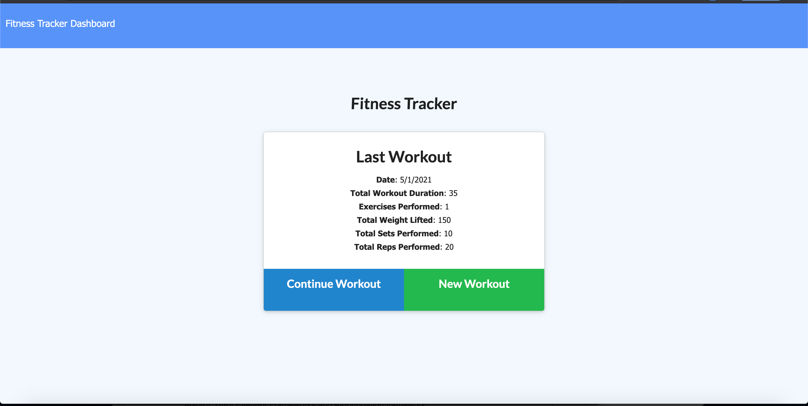
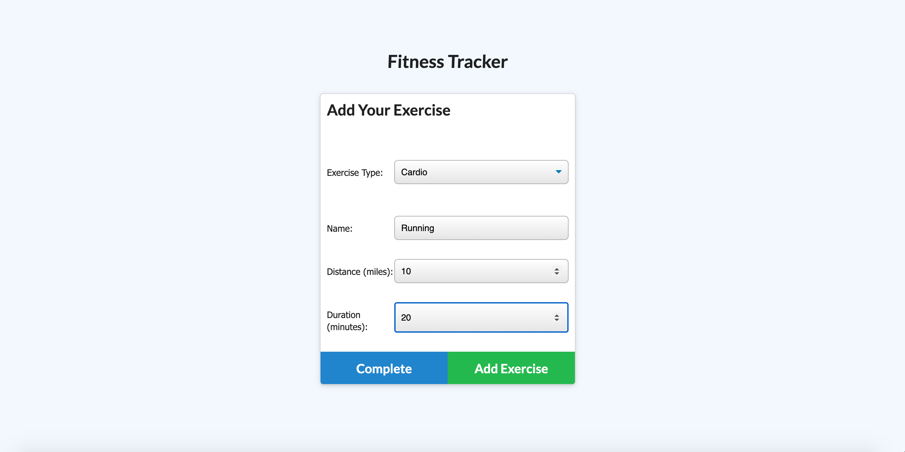
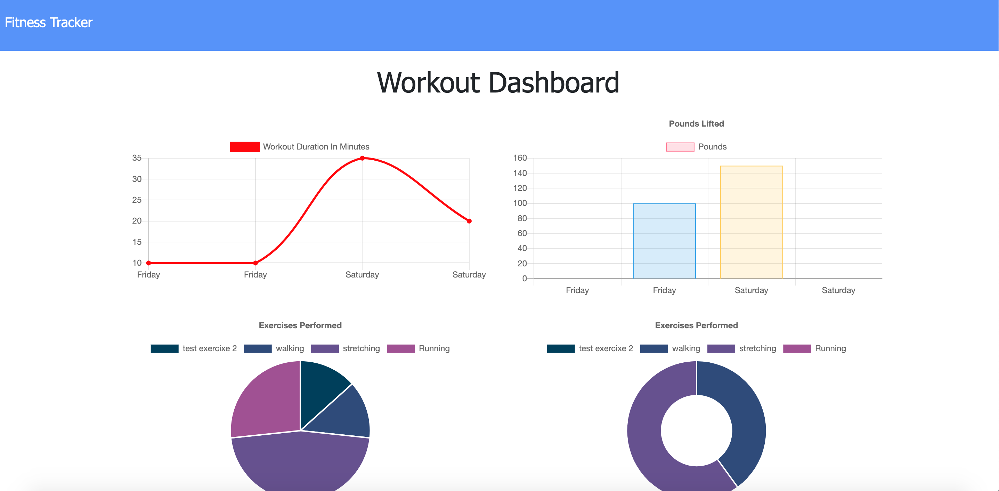

# FitnessTracker
[FitnessTracker](#FitnessTracker)
    - [Table of Contents](#table-of-contents)
  * [Summary](#summary)
  * [Description](#description)
  * [Pre-requisite](#pre-requisite)
  * [Demo](#demo)
  * [Technologyused](#technologyused-)
  * [Install](#install-)
  * [Contributor](#contributor)
  * [Codebase](#codebase)
  * [Application Walk-through](#Application-walk-through)

## Summary
I want to be able to view create and track daily workouts. I want to be able to log multiple exercises in a workout on a given day. I should also be able to track the name, type, weight, sets, reps, and duration of exercise. If the exercise is a cardio exercise, I should be able to track my distance traveled.

## Description
A consumer will reach their fitness goals more quickly when they track their workout progress. When the user loads the page, they should be given the option to create a new workout or continue with their last workout.

The user should be able to:

  * Add exercises to the most recent workout plan.

  * Add new exercises to a new workout plan.

  * View the combined weight of multiple exercises from the past seven workouts on the `stats` page.

  * View the total duration of each workout from the past seven workouts on the `stats` page.

## Pre-requisite
Install NodeJS 

## Demo

## Technologyused:
<ul>
    <li> 
    <a href="https://nodejs.org/en/docs/" target="_blank">NodeJS <a>
    <li> 
    <a href="https://expressjs.com/en/guide/routing.html" target="_blank">Express.js<a>
    </li>
    <li> 
    <a href="https://www.mongodb.com/" target="_blank">MongoDB</a>
    </li>
</ul>

## Install:
<strong>Code installation:</strong>  
$ cd [path_to_save_codebase]  
$ git clone https://github.com/arti-karnik/FitnessTracker 

<strong> Run the application: </strong>  
Open Terminal  
$ npm install  
$ npm run seed  
$ npm start  
 
## Contributor
<strong> Github Profile: </strong>  
https://github.com/arti-karnik

<strong> Portfolio: </strong>  
https://arti-karnik.github.io/MyPortfolioPage/

## Codebase
https://github.com/arti-karnik/FitnessTracker

## Application Walk-through
<a href="https://aqueous-reaches-20472.herokuapp.com/" target="_blank"> Click here for Application Live url </a>

